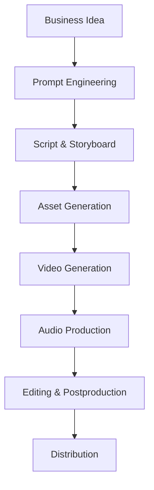
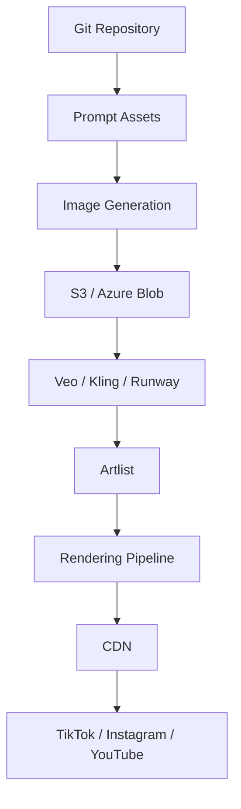

# AI Cinema Platform Architecture

## Overview

AI Cinema Lab applies Platform Engineering principles to AI-powered media production.

## Platform Architecture

## Core Principles

- Content as Code
- Prompt Versioning
- FinOps Governance
- Automated Rendering
- Reusable Campaign Assets
- Platform Engineering for Creative Workflows

## Reference Workflow

1. Business Brief
2. Prompt Engineering
3. Storyboard Generation
4. Asset Creation
5. Video Rendering
6. Audio Composition
7. Post Production
8. Distribution
