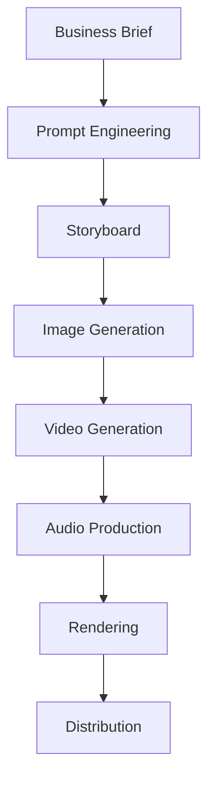

# 🌌 AI Cinema Lab

*Hecho con amor y estilo por Miguel Ángel Carvajal & Antigravity (Google DeepMind) 🎬🖤*

AI Cinema Lab applies Platform Engineering, FinOps, and Generative AI principles to media production.

From creative brief to published commercial:


---

## 🎯 Vision

Treat media production as a software delivery pipeline.

Instead of manually creating every asset, AI Cinema Lab combines:

- Prompt Engineering
- Generative Video
- Automated Rendering
- FinOps Governance
- Platform Engineering

to produce commercial content at scale.

---

## 🏗 Reference Architecture

See:

- [AI Cinema Pipeline](./AI-CINEMA-PIPELINE.md)
- [Platform Architecture](./docs/architecture.md)
- [FinOps Governance](./docs/finops.md)
- [Roadmap](./docs/roadmap.md)

---

## 🎬 Production Workflow



---

## 📂 Repository Structure

```text
ai-cinema-lab/
├── README.md
├── AI-CINEMA-PIPELINE.md
├── docs/
│   ├── architecture.md
│   ├── finops.md
│   └── roadmap.md
├── campaigns/
├── assets/
├── render_movie.py
└── config.json
```

---

## 💰 FinOps

AI Cinema Lab incorporates cost governance into creative workflows.

Examples:

- Budget thresholds
- Asset reuse
- Controlled rendering
- Cost attribution
- Future cost dashboards

---

## 🚀 Long-Term Vision

Build an AI-native media production platform that applies:

- Platform Engineering
- DevOps
- FinOps
- Generative AI

to transform content creation into a scalable, observable, and repeatable production system.

---

## 🧪 Current Campaigns

### R&JC FundaCerveza

First commercial campaign developed within AI Cinema Lab.

---

## 📜 License

This repository is intended for experimentation, learning, and AI-powered media production research.