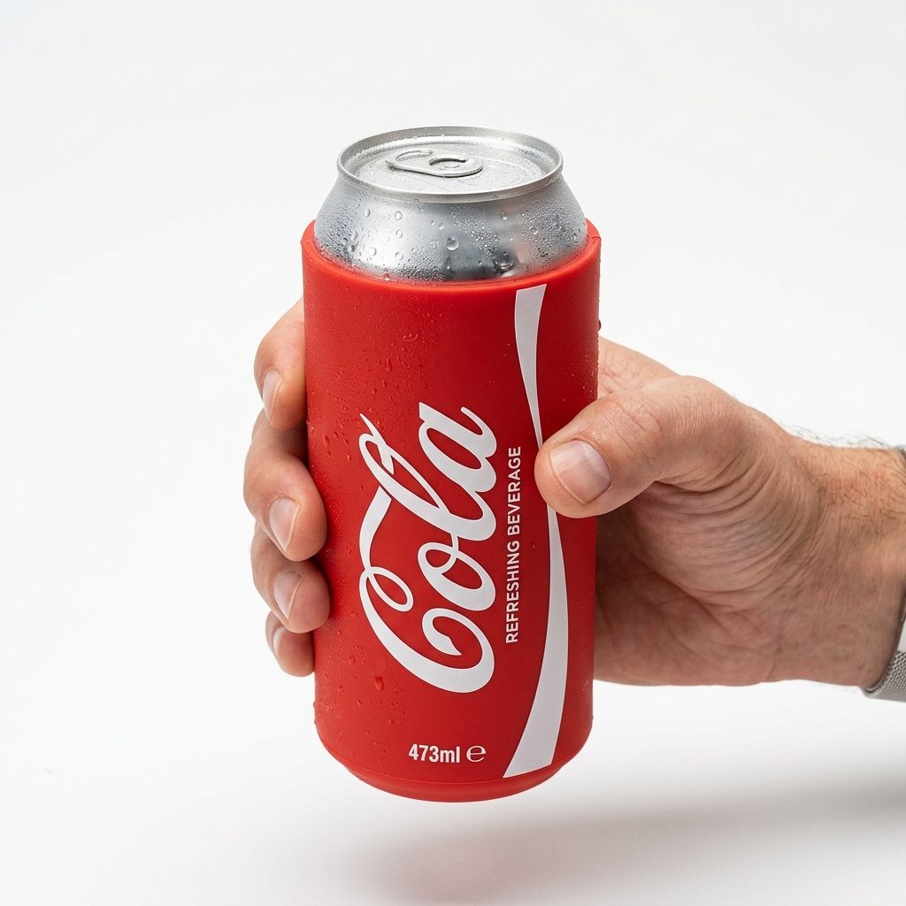
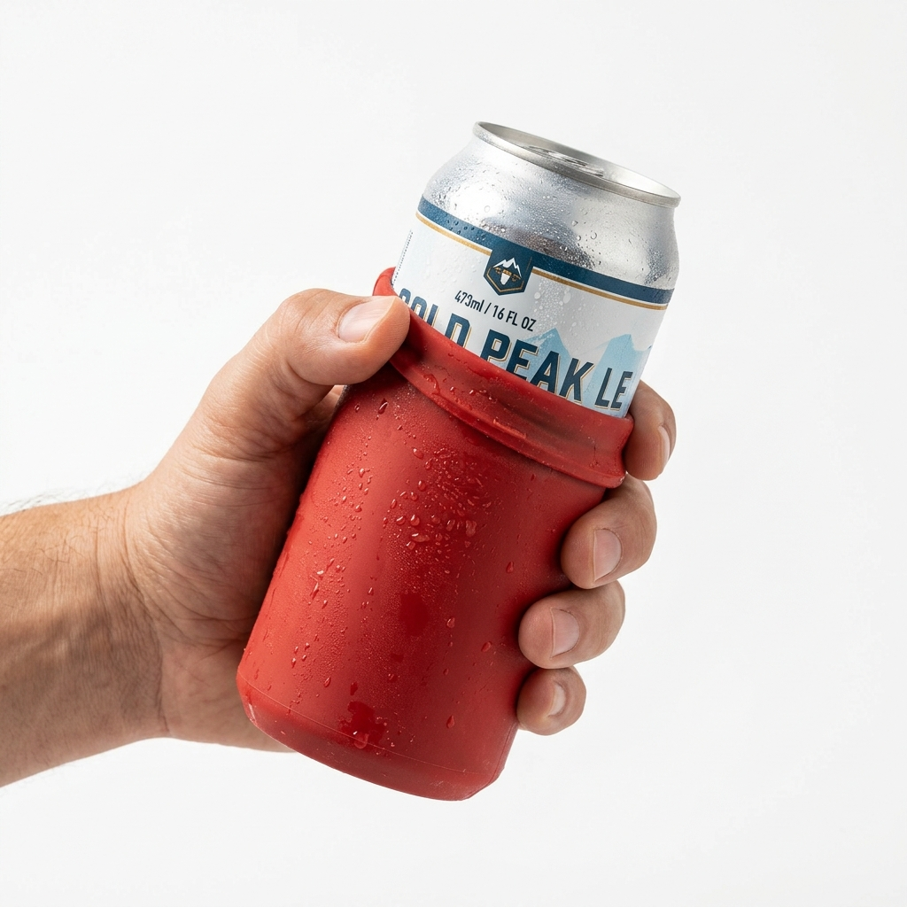

# 📸 R & JC FundaCerveza — Galería de Fotos de Producto (Proporciones Reales)

Estas imágenes fueron generadas utilizando el modelo local **Nano Banana** ($0 costo) siguiendo las técnicas de especificación de escala de producto y contexto de uso sugeridas.

````carousel

**Foto de Producto: Camuflaje Completo**
*   **Detalles:** Relación de aspecto mano-lata realista (~70% de altura de la mano). Proporciones exactas de una lata de 473ml sin distorsión.

<!-- slide -->

**Foto de Producto: El Reveal (Deslizado)**
*   **Detalles:** Muestra la funda deslizándose hacia abajo para revelar el borde metálico de la lata de cerveza, manteniendo proporciones reales y la textura del silicón.
````

### 💡 Observaciones sobre las Proporciones
*   **Escala Realista:** Al anclar el tamaño específico ("473ml beer can", "Amazon product photography"), el modelo respetó el tamaño de la mano con respecto a la lata, evitando el efecto de "lata gigante" anterior.
*   **Fidelidad de Marca:** Describir la funda como *"resembling a classic cola can"* en lugar de *"exactly like a popular brand"* permitió obtener el color y estilo clásico de refresco sin generar logos extraños o distorsionados.
