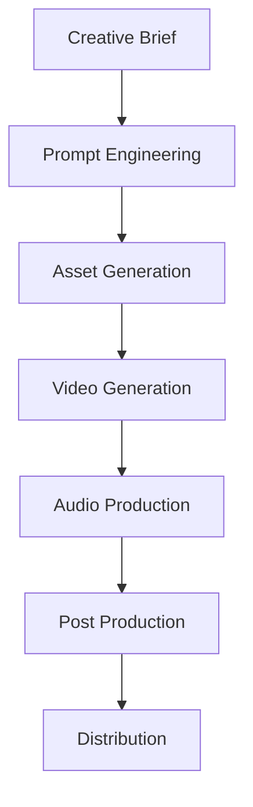
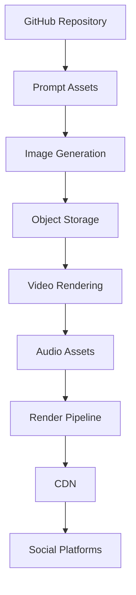

# AI Cinema Platform Reference Architecture

## Vision

AI Cinema Lab treats media production as a software delivery pipeline.

## High-Level Architecture

## Platform Architecture

## Core Principles

- Content as Code
- Versioned Prompts
- FinOps Governance
- Reusable Assets
- Automated Delivery
- Observability
